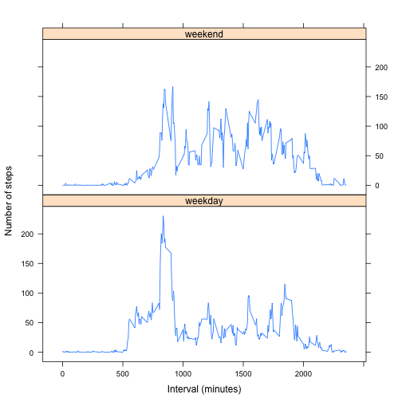

## Loading and preprocessing the data

### Loading Libraries and defining global variables

```r
library(dplyr)
library(lattice)

fileURL      <- "https://d396qusza40orc.cloudfront.net/repdata%2Fdata%2Factivity.zip"
localZipFile <- "activity.zip"
localFile    <- "./data/activity.csv"
inputRmdFile <- "PA1_template.Rmd"
```

### Helper functions

```r
## Download and Extract Zip data file
downloadAndExtractZipFile <- function(){
  ## check if the data folder exists
  if(!file.exists("data")){
    dir.create("data")
  }
  
  ## check if local file already exists
  if(!file.exists(localFile)){
    
    ## check if zip file exists - if not download the zip file with the data
    if(!file.exists(localZipFile)){
      download.file(fileURL, destfile = localZipFile, method = "curl")
    }
    
    ## extract the zip file
    unzip(localZipFile, overwrite = TRUE, exdir = "./data")
  }
}

## Reads the CSV data file
readCSVFile <- function(fileName, ...){
  if(! file.exists(fileName)){
    stop(paste("readDataFile: File ", fileName, " doesn't exist"))
  }
  
  print(paste("Reading file ", fileName))
  read.csv(fileName, ...)
}
```

### Load the activity.csv file (unzip and download if needed) and transforme the date field to Date type 

```r
downloadAndExtractZipFile()

data <- readCSVFile(localFile) %>%
  mutate(date = as.Date(date))
```

```
## [1] "Reading file  ./data/activity.csv"
```

```r
summary(data)
```

```
##      steps             date               interval     
##  Min.   :  0.00   Min.   :2012-10-01   Min.   :   0.0  
##  1st Qu.:  0.00   1st Qu.:2012-10-16   1st Qu.: 588.8  
##  Median :  0.00   Median :2012-10-31   Median :1177.5  
##  Mean   : 37.38   Mean   :2012-10-31   Mean   :1177.5  
##  3rd Qu.: 12.00   3rd Qu.:2012-11-15   3rd Qu.:1766.2  
##  Max.   :806.00   Max.   :2012-11-30   Max.   :2355.0  
##  NA's   :2304
```

## What is mean total number of steps taken per day?
### A histogram of the total number of steps taken each day

```r
## Group the data by day (date field) and calculate the sum of all steps per day
numSteps <- data %>%
    group_by(date) %>%
    summarise(totalSteps = sum(steps))

## Create a histogram with the total of steps per day
hist(x = numSteps$totalSteps, freq = TRUE,
     xlab = "Total number of steps", labels = TRUE,
     main = "")
```

 

### Calculate and report the mean and median total number of steps taken per day
#### Mean of total number of steps taken per day

```r
mean(numSteps$totalSteps, na.rm = TRUE)
```

```
## [1] 10766.19
```
#### Median of total number of steps taken per day

```r
median(numSteps$totalSteps, na.rm = TRUE)
```

```
## [1] 10765
```

## What is the average daily activity pattern?

### A time series plot (i.e. type = "l") of the 5-minute interval (x-axis) and the average number of steps taken, averaged across all days (y-axis)

```r
## Group the data by interval and then calculate the average (mean) of the number 
## of steps taken across all days 
daily <- data %>%
  group_by(interval) %>%
  summarise(av = mean(steps, na.rm = TRUE))

## Create time series plot
plot(x = daily$interval, y = daily$av, type = "l", main = "",
     xlab = "Interval (minutes)",
     ylab = "Average of steps taken")
```

 

### Which 5-minute interval, on average across all the days in the dataset, contains the maximum number of steps?

```r
daily$interval[daily$av == max(daily$av)]
```

```
## [1] 835
```

## Imputing missing values

### Calculate and report the total number of missing values in the dataset

```r
nas <- data %>%
  filter(is.na(steps))
nrow(nas)
```

```
## [1] 2304
```

### Devise a strategy for filling in all of the missing values in the dataset

```r
## To fill the missing values (NAs) I decided to calculate the mean for that 5-minute
## interval. For that I use the original data, filter off all the NAs rows, group by 
## interval and calculate the mean for the steps 
meanStepsInterval <- data %>%
  filter(!is.na(steps)) %>%
  group_by(interval) %>%
  summarise(mean = mean(steps))
```

### Create a new dataset that is equal to the original dataset but with the missing data filled in

```r
## The original dataset (data) is merged with the dataset created for the filling 
## strategy (meanStepsInterval), for all the NAs values under steps columns it is 
## replaced by the mean (this column comes from the meanStepsInterval dataset) and 
## finally remove the mean column
newData <- 
  merge(x = data, y = meanStepsInterval, by.x = "interval", by.y = "interval", 
        all.x = TRUE) %>%
  mutate(steps = ifelse(is.na(steps), mean, steps)) %>%
  select(-mean)
```

### Make a histogram of the total number of steps taken each day

```r
## Using the new dataset (without NAs), group the data by day (date field) and 
## calculate the total os steps per day (sum)
newNumSteps <- newData %>%
    group_by(date) %>%
    summarise(totalSteps = sum(steps))

## Create a histogram with the total of steps per day using the new dataset
hist(x = newNumSteps$totalSteps, freq = TRUE,
     xlab = "Total number of steps", labels = TRUE,
     main = "")
```

 

#### Mean of total number of steps taken per day

```r
mean(newNumSteps$totalSteps)
```

```
## [1] 10766.19
```

#### Median of total number of steps taken per day

```r
median(newNumSteps$totalSteps)
```

```
## [1] 10766.19
```

### Do these values differ from the estimates from the first part of the assignment? 
Yes, the values differ.

### What is the impact of imputing missing data on the estimates of the total daily number of steps?
The results differ from the first histogram because we replace all the NAs by the mean per interval 
and the first histogram the NAs values were "ignored".
The mean is the same since we use the mean values to fill the NAs, but the median changed slightly.

## Are there differences in activity patterns between weekdays and weekends?

### Create a new factor variable in the dataset with two levels – “weekday” and “weekend” indicating whether a given date is a weekday or weekend day.

```r
## Create a new dataset (weekdayData) using the the dataset without NAs and adding
## a variable with the weekday (day) and a 2nd variable (typeDay) that is a factor
## with two levels ("weekday" and "weekend")
weekdayData <- newData %>%
  mutate(day = weekdays(date), 
         typeDay = factor(
           ifelse(day %in% c("Saturday", "Sunday"), 
                                 "weekend", "weekday")))

str(weekdayData)
```

```
## 'data.frame':	17568 obs. of  5 variables:
##  $ interval: int  0 0 0 0 0 0 0 0 0 0 ...
##  $ steps   : num  1.72 0 0 0 0 ...
##  $ date    : Date, format: "2012-10-01" "2012-11-23" ...
##  $ day     : chr  "Monday" "Friday" "Sunday" "Tuesday" ...
##  $ typeDay : Factor w/ 2 levels "weekday","weekend": 1 1 2 1 2 1 2 1 1 2 ...
```

### Make a panel plot containing a time series plot (i.e. type = "l") of the 5-minute interval (x-axis) and the average number of steps taken, averaged across all weekday days or weekend days (y-axis)

```r
## Using the dataset created on the previous step (weekdayData), group by weekday/weekend (typeDay)
## and calculate the average (mean)
newDaily <- weekdayData %>%
  group_by(typeDay, interval) %>%
  summarise(av = mean(steps))

## Create the time series plot (using lattice library) of average steps over 5-minutes
## interval across weekday or weekend days
plot <- xyplot(av ~ interval | typeDay, data = newDaily, type = "l",
             xlab = "Interval (minutes)",
             ylab = "Number of steps",
             main = "",
             layout = c(1, 2))

## print the plot
print(plot)
```

 


